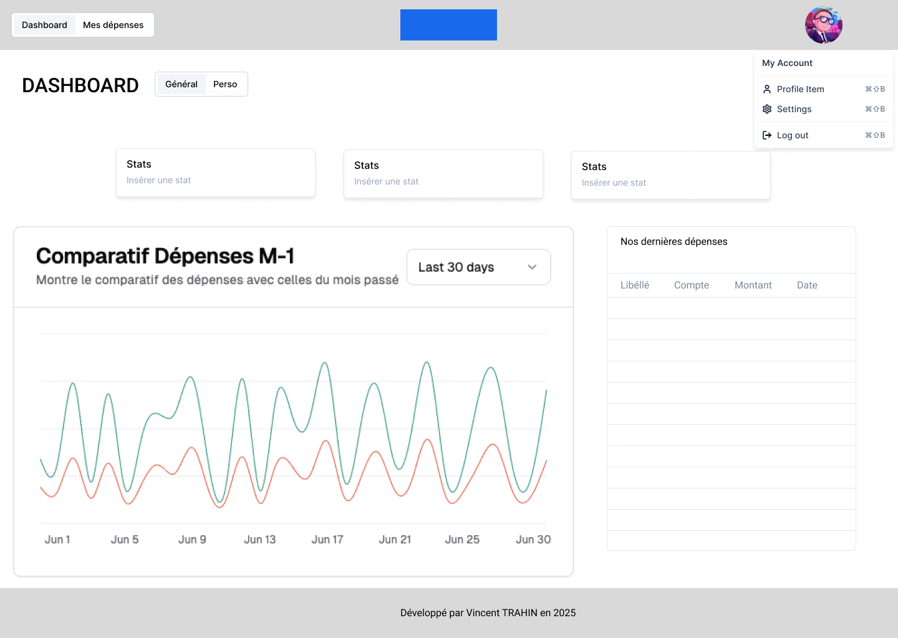

# **Cahier des Charges - Application TopBudget**

## **1. Présentation du projet**

### **Objectif principal**

Créer une application simple et intuitive permettant de gérer :

- **Ton budget personnel**,
- **Le budget personnel de ta femme**,
- **Votre budget commun**,

avec des statistiques détaillées et des filtres pertinents pour optimiser la gestion financière au quotidien.

---

## **2. Fonctionnalités principales - Version 1**

### **2.1. Gestion des dépenses**

#### **Ajout d’une dépense :**

L’utilisateur pourra ajouter une dépense avec les informations suivantes :

- Montant,
- Catégorie (ex : alimentation, logement, loisirs, transport),
- Date,
- Compte associé (perso, conjoint, commun),
- Commentaires (champ libre pour ajouter des détails).

#### **Modification d’une dépense :**

- Possibilité d’éditer toutes les informations d’une dépense existante.

#### **Suppression d’une dépense :**

- Option pour supprimer une dépense enregistrée par erreur ou devenue obsolète.

#### **Consultation des dépenses :**

- Affichage sous forme de **liste chronologique** ou triée par **catégorie**,
- **Filtres** disponibles :
  - Par catégorie,
  - Par date (journalière, hebdomadaire, mensuelle),
  - Par type de compte (perso, conjoint, commun).

---

### **2.2. Statistiques et visualisation**

#### **Statistiques personnelles :**

- Graphiques (camembert, histogramme) pour visualiser les **catégories les plus dépensières**,
- Comparaison des dépenses par mois pour observer les augmentations ou diminutions,
- Indicateurs d’évolution (exemple : "X% d’augmentation par rapport au mois dernier").

#### **Statistiques combinées (budget commun) :**

- Visualisation globale des dépenses journalières et mensuelles,
- Comparaison des contributions respectives au budget commun,
- Analyse des **charges fixes communes** pour assurer une répartition équitable.
  - Fonctionnalité pour calculer les écarts et indiquer qui doit combien à l’autre.

#### **Synthèse mensuelle :**

- Résumé des dépenses : perso / conjoint / commun,
- Mise en avant des catégories ayant connu une **augmentation significative**.

---

### **2.3. Partage et synchronisation**

- Accès partagé à l’application permettant aux deux utilisateurs (toi et ta femme) :
  - De consulter les budgets en temps réel,
  - D’ajouter ou modifier des dépenses instantanément.

---

## **3. Fonctionnalités avancées - Version 2**

### **3.1. Budget prévisionnel**

- Fixer des limites de dépenses pour chaque catégorie (exemple : 500 € pour l’alimentation/mois),
- Recevoir une alerte lorsque le budget d’une catégorie approche de la limite.

### **3.2. Récapitulatif automatisé**

- Génération d’un rapport financier mensuel en PDF pour une vision claire de vos finances.
  - Détail des contributions personnelles et des dépenses communes.

### **3.3. Comparaison des dépenses entre utilisateurs**

- Visualisation de la répartition des dépenses pour mieux équilibrer les contributions.

### **3.4. Widget d’accueil**

- Affichage rapide des données clés sur l’écran d’accueil :
  - Dépenses journalières,
  - Récapitulatif mensuel,
  - Budget restant pour le mois.

---

## **4. Contraintes techniques et technologies envisagées**

### **4.1. Front-End**

### **Technologie principale : Next.js**

Next.js est un framework basé sur React qui permet de développer des applications web modernes avec des fonctionnalités avancées telles que le rendu côté serveur (SSR) et la génération statique (SSG). Il offre :

- Une meilleure performance grâce au SSR, idéal pour optimiser le SEO.
- Une expérience utilisateur fluide et rapide grâce à son architecture moderne.

1. **Tailwind CSS**
   - Framework CSS utilitaire pour concevoir des interfaces modernes rapidement.
   - Facile à intégrer avec Next.js pour un design réactif et élégant.
2. **React Query**
   - Gestion des données côté client pour synchroniser facilement ton front-end avec ton back-end.
   - Idéal pour les requêtes API et la mise en cache automatique

### **Outils complémentaires (facultatifs) :**

1. **Formik + Yup**
   - Gestion des formulaires avec Formik (simplicité) et validation des données avec Yup (puissant et facile à utiliser).

---

### **4.2. Back-End**

### **Technologies principales : Node.js et MongoDB**

- **Node.js avec Express.js** pour le développement du serveur et des API REST.
- **MongoDB Atlas** comme base de données NoSQL, gérée dans le cloud pour une configuration rapide et sécurisée.

### **Recommandations pour l’authentification et la sécurité :**

1. **JWT (JSON Web Tokens)**
   - Gestion des sessions utilisateurs via des tokens sécurisés.
   - Avantage : léger, efficace, et parfaitement compatible avec Node.js.
2. **bcrypt**
   - Hachage des mots de passe pour assurer leur sécurité avant de les stocker dans la base de données.
3. **Helmet.js**
   - Améliore la sécurité des en-têtes HTTP pour protéger l’application contre des attaques comme XSS ou les attaques CSRF.
4. **Express-validator**
   - Valide les entrées des utilisateurs pour éviter les injections SQL ou autres attaques basées sur des données malveillantes.
5. **Mongoose**
   - ORM pour faciliter la gestion des interactions entre Node.js et MongoDB.
   - Simplifie la création des schémas de données.
6. **Winston ou Morgan**
   - Gestion des logs pour suivre les activités de ton application et détecter d’éventuelles anomalies.

### **Outils complémentaires (facultatifs) :**

1. **Rate-limiter-flexible**
   - Limite le nombre de requêtes provenant d’une même IP pour prévenir les attaques par déni de service (DDoS).

---

### **4.3. Hébergement**

### **Technologie principale : Heroku**

Heroku offre une solution clé en main pour héberger ton application Node.js avec des fonctionnalités comme :

- Déploiement simple via Git ou CLI Heroku.
- Gestion facile des variables d’environnement (ex : clés JWT, URI MongoDB Atlas).
- Add-on natif pour MongoDB Atlas.

### **Base de données : MongoDB Atlas**

- Hébergement cloud natif pour MongoDB.
- Facilité d’intégration avec Heroku via un add-on dédié.
- Sécurité renforcée avec des connexions chiffrées (SSL).

### **Outils complémentaires (facultatifs) :**

1. **Cloudflare**
   - Ajout d’une couche de protection contre les attaques DDoS.
   - Accélération des performances via un CDN.
2. **PM2 (Process Manager)**
   - Gestion des processus Node.js en production pour garantir une haute disponibilité.

---

### **4.4. Visualisation des données**

### **Technologie principale : Chart.js**

- Librairie légère et efficace pour créer des graphiques interactifs et visuellement attrayants.
- Parfaitement compatible avec Next.js pour intégrer les statistiques de manière fluide.

### **Outils complémentaires (facultatifs) :**

1. **React-chartjs-2**
   - Wrapper React pour Chart.js, simplifiant l’intégration dans une application Next.js.
2. **D3.js** (si besoin de graphiques très personnalisés)
   - Librairie puissante pour concevoir des visualisations complexes.

---

## **5. Conception de l’interface utilisateur - Version 1**

### **5.1. Page d’accueil (Tableau de bord)**

### **5.2. Gestion des dépenses**

---

## **6. Conception technique et modélisation**

### **6.1. User Stories**

| Fonctionnalité                     | En tant que ... | Je souhaite ...                                                                      | Afin de ...                                          |
| ---------------------------------- | --------------- | ------------------------------------------------------------------------------------ | ---------------------------------------------------- |
| **Ajout d’une dépense**            | Utilisateur     | Ajouter une dépense avec un montant, une catégorie, une date, et un compte associé   | Mieux suivre mes dépenses                            |
|                                    | Utilisateur     | Ajouter un commentaire à chaque dépense                                              | Noter des détails spécifiques                        |
| **Modification d’une dépense**     | Utilisateur     | Modifier les informations d’une dépense existante                                    | Corriger des erreurs ou mettre à jour les détails    |
| **Suppression d’une dépense**      | Utilisateur     | Supprimer une dépense enregistrée par erreur ou devenue obsolète                     | Maintenir la liste des dépenses propre               |
| **Consultation des dépenses**      | Utilisateur     | Consulter mes dépenses sous forme de liste                                           | Visualiser toutes les informations rapidement        |
|                                    | Utilisateur     | Filtrer mes dépenses par catégorie, date ou type de compte                           | Retrouver des informations spécifiques               |
| **Visualisation des statistiques** | Utilisateur     | Voir une répartition graphique de mes dépenses par catégorie                         | Identifier les catégories les plus dépensières       |
|                                    | Utilisateur     | Comparer mes dépenses entre différents mois                                          | Observer les variations dans mes dépenses            |
| **Synthèse rapide**                | Utilisateur     | Voir les 3 indicateurs les plus importants sur le tableau de bord                    | Effectuer un suivi rapide                            |
| **Partage et synchronisation**     | Utilisateur     | Accéder à l’application depuis mon compte personnel                                  | Voir mes données synchronisées                       |
| **Navigation et UI**               | Utilisateur     | Basculer facilement entre mes dépenses personnelles et communes via un menu dropdown | Naviguer rapidement                                  |
|                                    | Utilisateur     | Un tableau clair et organisé pour afficher mes dépenses                              | Visualiser les colonnes comme libellé, montant, etc. |
| **Gestion des catégories**         | Utilisateur     | Ajouter une nouvelle catégorie de dépenses                                           | Personnaliser le suivi de mes dépenses               |
|                                    | Utilisateur     | Modifier ou supprimer des catégories existantes                                      | Maintenir une liste propre et pertinente             |
| **Sécurité et authentification**   | Utilisateur     | Me connecter de manière sécurisée avec mon compte                                    | Protéger mes données                                 |
|                                    | Utilisateur     | Être automatiquement déconnecté après une période d’inactivité                       | Garantir la sécurité                                 |

### **6.2. Use Case**

### **6.3. Diagramme d’entité-association (Classes)**

### **6.4. Diagramme de séquence**

### **6.5. Diagramme d’activité**

### **6.6. Diagramme de déploiement**

### **6.7. Schéma d’architecture**

---

## **7. Fonctionnalités prioritaires (MVP - Minimum Viable Product)**

1. **Gestion des dépenses :**
   - Ajout d’une dépense (montant, catégorie, date, compte associé, commentaires).
   - Consultation des dépenses (liste simple chronologique).
   - Modification et suppression d’une dépense.
2. **Statistiques :**
   - Graphique de répartition des dépenses par catégorie (camembert).
   - Évolution des dépenses mensuelles (barres).
3. **Partage et synchronisation :**
   - Accès pour deux utilisateurs avec une gestion basique des comptes :
     - Compte personnel (toi).
     - Compte conjoint (ta femme).
     - Compte commun.
4. **Interface utilisateur :**
   - Dashboard simple avec une vue des dépenses et graphiques.
   - Menu de navigation latéral avec trois onglets : "Dashboard", "Mes Dépenses", "Statistiques".
5. **Backend sécurisé :**
   - API REST pour gérer les dépenses.
   - Authentification par JWT.
   - Stockage des données avec MongoDB Atlas.
6. **Hébergement :**
   - Déploiement sur Heroku.

### **Exclusions pour la V1 :**

- Budget prévisionnel.
- Comparaisons détaillées des dépenses entre utilisateurs.
- Rapports PDF.
- Widgets ou animations complexes.
